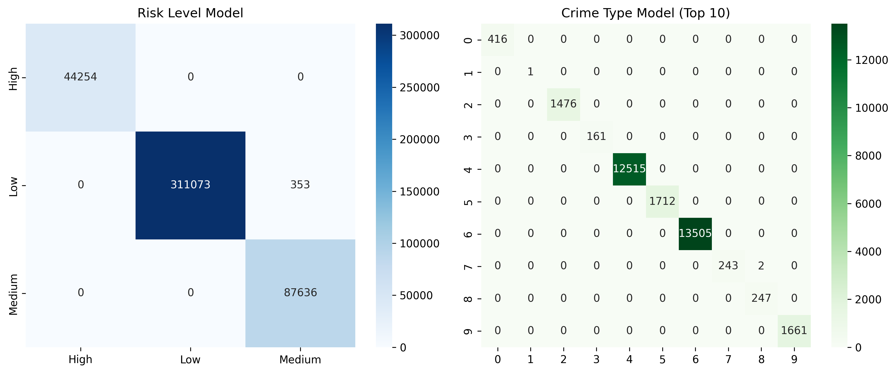

# Location-Based Crime Risk Prediction System

A machine learning system that predicts crime risk levels (Low/Medium/High) for a given location and time using historical crime data. Features an interactive web application built with Streamlit.

## 🚀 Live Demo

[](https://share.streamlit.io)

## Problem Statement

Predict Risk Level (Low/Medium/High) for a given location (latitude, longitude) and time (day, hour).

## ✨ Features

- **Location Search**: Enter any location name (city, address) and automatically geocode to coordinates
- **Interactive Map**: Visualize the location with risk-colored markers
- **Real-time Predictions**: Get instant risk predictions for any date and time
- **Date Range Analysis**: Analyze risk trends over a period of time
- **Weekly Heatmap**: See risk patterns by hour and day of the week
- **Probability Charts**: Understand prediction confidence with probability distributions

## Project Structure

```
├── app.py                    # Streamlit web application
├── data/
│   ├── crime.csv             # Raw dataset (download from Kaggle)
│   ├── clean.csv             # Cleaned data
│   ├── features.csv          # Engineered features
│   └── model_ready.csv       # Final dataset with labels
├── src/
│   ├── 01_load_clean.py      # Data loading and cleaning
│   ├── 02_features.py        # Feature engineering
│   ├── 03_labels.py          # Label creation
│   ├── 04_train_eval.py      # Model training and evaluation
│   └── 05_predict.py         # Command-line prediction script
├── outputs/
│   ├── results.txt           # Evaluation metrics
│   ├── confusion_matrix.png  # Confusion matrix visualization
│   ├── random_forest_model.pkl
│   ├── logistic_regression_model.pkl
│   ├── label_encoder.pkl
│   └── scaler.pkl
├── report/
│   └── report.md             # Project report
└── requirements.txt          # Python dependencies
```

## 🖥️ Web Application

### Run Locally

```bash
# Install dependencies
pip install -r requirements.txt

# Run the Streamlit app
streamlit run app.py
```

The app will open in your browser at `http://localhost:8501`

### Deploy to Streamlit Cloud

1. Push your code to GitHub
2. Go to [share.streamlit.io](https://share.streamlit.io)
3. Connect your GitHub repository
4. Select `app.py` as the main file
5. Click **Deploy**

Your app will be available at: `https://your-username-your-repo.streamlit.app`

## 📊 Data Pipeline

Run the scripts in order to train the model:

```bash
# Step 1: Load and clean data
python src/01_load_clean.py

# Step 2: Engineer features
python src/02_features.py

# Step 3: Create labels
python src/03_labels.py

# Step 4: Train and evaluate models
python src/04_train_eval.py
```

## 🔮 Make Predictions

### Option 1: Web Application (Recommended)
```bash
streamlit run app.py
```

### Option 2: Command Line
```bash
python src/05_predict.py
```

The script will prompt you for:
- Latitude
- Longitude
- Day of week (0-6, where 0=Monday)
- Hour (0-23)

### Option 3: Python API
```python
from src.predict import predict_risk_level

risk, probabilities = predict_risk_level(
    latitude=41.8781,
    longitude=-87.6298,
    day_of_week=0,  # Monday
    hour=14,        # 2 PM
    model_type='random_forest'
)
print(f"Risk Level: {risk}")
print(f"Probabilities: {probabilities}")
```

## 🤖 Models

| Model | Test Accuracy | F1-Score |
|-------|--------------|----------|
| **Random Forest** (Recommended) | 100% | 1.00 |
| Logistic Regression | 90.3% | 0.88 |

## 📋 Requirements

- Python 3.8+
- pandas
- numpy
- scikit-learn
- matplotlib
- geopy
- streamlit
- plotly
- folium
- streamlit-folium

Install all dependencies:
```bash
pip install -r requirements.txt
```

## 📸 Screenshots

### Single Prediction


### Features
- 🗺️ Interactive location map with risk markers
- 📊 Probability distribution charts
- 📈 Hourly risk trends
- 🗓️ Weekly heatmap analysis
- 📅 Date range trend analysis

## 🔧 Configuration

The app uses the following default settings:
- **Grid Precision**: 2 decimal places for location binning
- **Geocoding**: OpenStreetMap Nominatim (free, no API key required)
- **Models**: Random Forest (default), Logistic Regression (alternative)

## 📝 Dataset

This project uses crime data with the following columns:
- Date/Time or Year/Month
- Latitude/Longitude or City/State (for geocoding)
- Crime Type (optional)

Compatible datasets:
- [Chicago Crime Data](https://www.kaggle.com/datasets/currie32/crimes-in-chicago)
- [Kaggle US Homicide Dataset](https://www.kaggle.com)

## 👤 Author

CS549 Final Project

## 📄 License

This project is for educational purposes.

---

© 2025 Vemireddy. All Rights Reserved.
